# 做一些很Cool的事情🤳

---

---

## Skills And Tools

<table>
    <tr>
        <td rowspan="100">
            
        </td>
    </tr>
    <tr>
        <td colspan="100">Language</td>
    </tr>  
    <tr>
        <td>
            
        </td>
        <td>
            
        </td>
        <td>
            
        </td>
        <td>
            
        </td>
    </tr>
    <tr>
        <td colspan="100">Tool</td>
    </tr>  
    <tr>
        <td>
            
        </td>
        <td>
            
        </td>
        <td>
            
        </td>
        <td>
            
        </td>
        <td>
            
        </td>
        <td>
            
        </td>
    </tr>
    <tr>
        <td colspan="100">Storage</td>
    </tr>  
    <tr>
        <td>
            
        </td>
        <td>
            
        </td>
        <td>
            
        </td>
        <td>
            
        </td>
        <td>
            
        </td>
        <td>
            
        </td>
    </tr>
    <tr>
        <td colspan="100">Framework</td>
    </tr>  
	<tr>
	    <td>
            
        </td>
	    <td>
            
        </td>
	</tr>
    <tr>
        <td colspan="100">System</td>
    </tr>  
    <tr>
        <td>
            
        </td>
        <td>
            
        </td>
        <td>
            
        </td>
        <td>
            
        </td>
        <td>
            
        </td>
        <td>
            
        </td>
        <td>
            
        </td>
        <td>
            
        </td>
    </tr>
</table>

---

## My Profile

---

###### _End_
